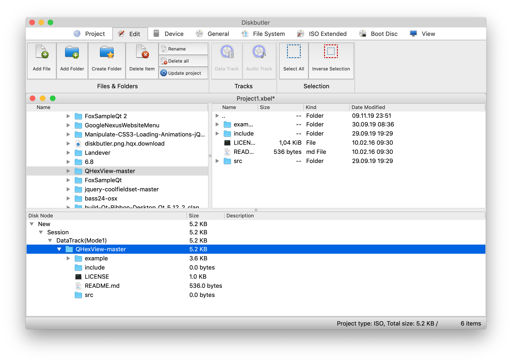

# Diskbutler

## The free x-platform CD/DVD/BD recording software

Diskbutler was born some time ago to bring a professional CD/DVD/BD recording software, that will work on macOS, Linux and Windows and with the full feature set, to the end user. 
Diskbutler is written in QT and use the well know FoxBurner SDK.

